

# Plutonium (PlutoT6)
   
- **PlutoT6** es el proyecto de **Plutonium** para poder jugar al **Call of Duty: Black Ops II** (con el nombre en clave (oficial) de **T6**).
  - También cuenta con su proyecto PlutoIW5 para Call of Duty: Modern Warfare 3 (IW5).

## Aviso
- :warning: Todo esto es para la **R372**, no podrás pedir soporte y quizás algún que otro enlace se encuentre caído/diferente.
  - Podrás seguir jugando incluso con Internet, abriendo puertos, etc. Pero el Cliente y Servidor deberán de iniciar con el Modo Offline.
    - No pienso actualizar esto, lo dejo archivado para los que no quieran actualizar y saben en donde se están metiendo.
- Este repositorio no contiene ningún código de PlutoT6, tan solo proporciona soporte y ayuda a los usuarios de habla hispana.
  - Si no sabes Español, puedes usar [DeepL](https://www.deepl.com/translator) como traductor de Español a X idioma.
- **Plutonium** no apoya la **piratería**, esto significa:
  - Aunque te den los archivos del juego, no te ayudarán si tienes copias piratas de mala calidad (como **Skidrow** / **nosTEAM**).

## Tabla de Contenidos
- :warning: Usa estos enlaces para acceder y navegar por la Wiki.
  - Si haces click en un link de la Wiki, te mandará a la versión actualizada (tan solo lee la URL y listo).
- [Inicio](../../../../wiki/Home/a8023d81fbc773d3397a7a75cce30de0c9f9fd8e)
  - [Características](../../../../wiki/Home/a8023d81fbc773d3397a7a75cce30de0c9f9fd8e#características)
  - [Guía de instalación de PlutoT6](../../../../wiki/Home/a8023d81fbc773d3397a7a75cce30de0c9f9fd8e#guía-de-instalación-de-plutot6)
  - [Pedir ayuda](../../../../wiki/Home/a8023d81fbc773d3397a7a75cce30de0c9f9fd8e#pedir-ayuda)
- [Cliente](../../../../wiki/Cliente/3f57dd61fe1c2731f1c5487388cc8b6d4a32671e)
  - [Requisitos](../../../../wiki/Cliente/3f57dd61fe1c2731f1c5487388cc8b6d4a32671e#requisitos)
    - [Aviso](../../../../wiki/Cliente/3f57dd61fe1c2731f1c5487388cc8b6d4a32671e#aviso)
  - [Proceso de Instalación](../../../../wiki/Cliente/3f57dd61fe1c2731f1c5487388cc8b6d4a32671e#proceso-de-instalación)
  - [Crear una partida](../../../../wiki/Cliente/3f57dd61fe1c2731f1c5487388cc8b6d4a32671e#crear-una-partida)
  - [Unirse a una partida](../../../../wiki/Cliente/3f57dd61fe1c2731f1c5487388cc8b6d4a32671e#unirse-a-una-partida)
- [Servidor](../../../../wiki/Servidor/a8023d81fbc773d3397a7a75cce30de0c9f9fd8e)
  - [Requisitos](../../../../wiki/Servidor/a8023d81fbc773d3397a7a75cce30de0c9f9fd8e#requisitos)
    - [Aviso](../../../../wiki/Servidor/a8023d81fbc773d3397a7a75cce30de0c9f9fd8e#aviso)
  - [Proceso de Instalación](../../../../wiki/Servidor/a8023d81fbc773d3397a7a75cce30de0c9f9fd8e#proceso-de-instalación)
  - [Configuración del Servidor Dedicado](../../../../wiki/Servidor/a8023d81fbc773d3397a7a75cce30de0c9f9fd8e#configuración-del-servidor-dedicado)
  - [Optimizar Servidor](../../../../wiki/Servidor/a8023d81fbc773d3397a7a75cce30de0c9f9fd8e#optimizar-servidor)
- [Preguntas Frecuentes](../../../../wiki/Preguntas-Frecuentes/a8023d81fbc773d3397a7a75cce30de0c9f9fd8e)
  - [¿Donde puedo descargar la última versión de PlutoT6?](../../../../wiki/Preguntas-Frecuentes/a8023d81fbc773d3397a7a75cce30de0c9f9fd8e#donde-puedo-descargar-la-última-versión-de-plutot6)
  - [¿Qué versiones del juego puedo usar para jugar por PlutoT6?](../../../../wiki/Preguntas-Frecuentes/a8023d81fbc773d3397a7a75cce30de0c9f9fd8e#qué-versiones-del-juego-puedo-usar-para-jugar-por-plutot6)
  - [¿Qué idiomas soporta PlutoT6?](../../../../wiki/Preguntas-Frecuentes/a8023d81fbc773d3397a7a75cce30de0c9f9fd8e#qué-idiomas-soporta-plutot6)
  - [¿Necesito los DLCs?](../../../../wiki/Preguntas-Frecuentes/a8023d81fbc773d3397a7a75cce30de0c9f9fd8e#necesito-los-dlcs)
  - [¿Puedo usar PlutoT6 en la misma carpeta que mi juego de Steam?](../../../../wiki/Preguntas-Frecuentes/a8023d81fbc773d3397a7a75cce30de0c9f9fd8e#puedo-usar-plutot6-en-la-misma-carpeta-que-mi-juego-de-steam)
  - [¿Cómo puedo verificar mis archivos?](../../../../wiki/Preguntas-Frecuentes/a8023d81fbc773d3397a7a75cce30de0c9f9fd8e#cómo-puedo-verificar-mis-archivos)
  - [¿Cómo puedo abrir la consola?](../../../../wiki/Preguntas-Frecuentes/a8023d81fbc773d3397a7a75cce30de0c9f9fd8e#cómo-puedo-abrir-la-consola)
  - [¿Cómo puedo cambiar mi nombre?](../../../../wiki/Preguntas-Frecuentes/a8023d81fbc773d3397a7a75cce30de0c9f9fd8e#cómo-puedo-cambiar-mi-nombre)
  - [¿Hay Matchmaking, servidores dedicados o algo?](../../../../wiki/Preguntas-Frecuentes/a8023d81fbc773d3397a7a75cce30de0c9f9fd8e#hay-matchmaking-servidores-dedicados-o-algo)
  - [¿Puedo usar el Modo Cine?](../../../../wiki/Preguntas-Frecuentes/a8023d81fbc773d3397a7a75cce30de0c9f9fd8e#puedo-usar-el-modo-cine)
  - [¿Debo abrir los Puertos?](../../../../wiki/Preguntas-Frecuentes/a8023d81fbc773d3397a7a75cce30de0c9f9fd8e#debo-abrir-los-puertos)
  - [¿Por qué no puedo ver mi propio servidor?](../../../../wiki/Preguntas-Frecuentes/a8023d81fbc773d3397a7a75cce30de0c9f9fd8e#por-qué-no-puedo-ver-mi-propio-servidor)
  - [¿Cómo puedo jugar Sin Internet / Offline?](../../../../wiki/Preguntas-Frecuentes/a8023d81fbc773d3397a7a75cce30de0c9f9fd8e#cómo-puedo-jugar-sin-internet--offline)
  - [¿Cuántos jugadores puedo tener en Zombis?](../../../../wiki/Preguntas-Frecuentes/a8023d81fbc773d3397a7a75cce30de0c9f9fd8e#cuántos-jugadores-puedo-tener-en-zombis)
  - [¿Puedo usar BOTS en servidores dedicados?](../../../../wiki/Preguntas-Frecuentes/a8023d81fbc773d3397a7a75cce30de0c9f9fd8e#puedo-usar-bots-en-servidores-dedicados)
  - [Quiero crear una clase ¿en donde la debo hacer?](../../../../wiki/Preguntas-Frecuentes/a8023d81fbc773d3397a7a75cce30de0c9f9fd8e#quiero-crear-una-clase-en-donde-la-debo-hacer)
  - [¿Cómo puedo desbloquear todo?](../../../../wiki/Preguntas-Frecuentes/a8023d81fbc773d3397a7a75cce30de0c9f9fd8e#cómo-puedo-desbloquear-todo)
  - [¿Cómo puedo desbloquear los camuflajes o usar los camuflajes del DLC 2?](../../../../wiki/Preguntas-Frecuentes/a8023d81fbc773d3397a7a75cce30de0c9f9fd8e#cómo-puedo-desbloquear-los-camuflajes-o-usar-los-camuflajes-del-dlc-2)
  - [¿Cómo puedo conservar / borrar mis estadísticas y demás datos de perfil?](../../../../wiki/Preguntas-Frecuentes/a8023d81fbc773d3397a7a75cce30de0c9f9fd8e#cómo-puedo-conservar--borrar-mis-estadísticas-y-demás-datos-de-perfil)
  - [¿Cómo vuelvo a abrir el menú de PlutoT6?](../../../../wiki/Preguntas-Frecuentes/a8023d81fbc773d3397a7a75cce30de0c9f9fd8e#cómo-vuelvo-a-abrir-el-menú-de-plutot6)
  - [¿Cómo puedo unirme a un servidor protegido con contraseña?](../../../../wiki/Preguntas-Frecuentes/a8023d81fbc773d3397a7a75cce30de0c9f9fd8e#cómo-puedo-unirme-a-un-servidor-protegido-con-contraseña)
- [Solución de problemas](../../../../wiki/Soluci%C3%B3n-de-problemas/28b996bf91ea01ccb3058752b4da02aa5fb3652b)
  - [Fallos Conocidos](../../../../wiki/Soluci%C3%B3n-de-problemas/28b996bf91ea01ccb3058752b4da02aa5fb3652b#fallos-conocidos)
  - [El punto de entrada del procedimiento AddDllDirectory no podía estar ubicado en la biblioteca de enlaces dinámicos KERNEL32.dll](../../../../wiki/Soluci%C3%B3n-de-problemas/28b996bf91ea01ccb3058752b4da02aa5fb3652b#el-punto-de-entrada-del-procedimiento-adddlldirectory-no-podía-estar-ubicado-en-la-biblioteca-de-enlaces-dinámicos-kernel32dll)
  - [La ejecución del código no puede continuar porque no se encontró binkw32.dll.](../../../../wiki/Soluci%C3%B3n-de-problemas/28b996bf91ea01ccb3058752b4da02aa5fb3652b#la-ejecución-del-código-no-puede-continuar-porque-no-se-encontró-binkw32dll)
  - [La ejecución del código no puede continuar porque no se encontró D3DCompiler_47.dll.](../../../../wiki/Soluci%C3%B3n-de-problemas/28b996bf91ea01ccb3058752b4da02aa5fb3652b#la-ejecución-del-código-no-puede-continuar-porque-no-se-encontró-d3dcompiler_47dll)
  - [La ejecución del código no puede continuar porque no se encontró XINPUT1_3.dll.](../../../../wiki/Soluci%C3%B3n-de-problemas/28b996bf91ea01ccb3058752b4da02aa5fb3652b#la-ejecución-del-código-no-puede-continuar-porque-no-se-encontró-xinput1_3dll)
  - [La ejecución del código no puede continuar porque no se encontró t6r/t6r.dll.](../../../../wiki/Soluci%C3%B3n-de-problemas/28b996bf91ea01ccb3058752b4da02aa5fb3652b#la-ejecución-del-código-no-puede-continuar-porque-no-se-encontró-t6rt6rdll)
  - [Failed to Load libcef](../../../../wiki/Soluci%C3%B3n-de-problemas/28b996bf91ea01ccb3058752b4da02aa5fb3652b#failed-to-load-libcef)
  - [Could not load default asset](../../../../wiki/Soluci%C3%B3n-de-problemas/28b996bf91ea01ccb3058752b4da02aa5fb3652b#could-not-load-default-asset)
  - [Menú principal vació, sin texto o pantalla en gris](../../../../wiki/Soluci%C3%B3n-de-problemas/28b996bf91ea01ccb3058752b4da02aa5fb3652b#menú-principal-vació-sin-texto-o-pantalla-en-gris)
  - [Authentication error: Unknown error. / Game will run in offline mode.](../../../../wiki/Soluci%C3%B3n-de-problemas/28b996bf91ea01ccb3058752b4da02aa5fb3652b#authentication-error-unknown-error--game-will-run-in-offline-mode)
  - [Could not authenticate to Plutonium!](../../../../wiki/Soluci%C3%B3n-de-problemas/28b996bf91ea01ccb3058752b4da02aa5fb3652b#could-not-authenticate-to-plutonium)
  - [El juego se crashea cuando se une el quinto jugador en Origin](../../../../wiki/Soluci%C3%B3n-de-problemas/28b996bf91ea01ccb3058752b4da02aa5fb3652b#el-juego-se-crashea-cuando-se-une-el-quinto-jugador-en-origin)
  - [Me aparece este error al iniciar mi Servidor Dedicado de Zombis: 8 script error(s) / 2 script error(s)](../../../../wiki/Soluci%C3%B3n-de-problemas/28b996bf91ea01ccb3058752b4da02aa5fb3652b#me-aparece-este-error-al-iniciar-mi-servidor-dedicado-de-zombis-8-script-errors--2-script-errors)
  - [UI ERROR 58339](../../../../wiki/Soluci%C3%B3n-de-problemas/28b996bf91ea01ccb3058752b4da02aa5fb3652b#ui-error-5xxxx-por-ejemplo-58339)
  - [Missing config file "default_mp.cfg" during initiliazation. May need to add to code_pre_gfx.](../../../../wiki/Soluci%C3%B3n-de-problemas/28b996bf91ea01ccb3058752b4da02aa5fb3652b#missing-config-file-default_mpcfg-during-initiliazation-may-need-to-add-to-code_pre_gfx)
  - [EXE_CONFIGSTRINGMISMATCH](../../../../wiki/Soluci%C3%B3n-de-problemas/28b996bf91ea01ccb3058752b4da02aa5fb3652b#exe_configstringmismatch)
  - [Estoy cargando un mapa y me salen cuadrados rojos/verdes](../../../../wiki/Soluci%C3%B3n-de-problemas/28b996bf91ea01ccb3058752b4da02aa5fb3652b#estoy-cargando-un-mapa-y-me-salen-cuadrados-rojosverdes)
  - [Siempre que hay un cambio de mapa, soy desconectado!](../../../../wiki/Soluci%C3%B3n-de-problemas/28b996bf91ea01ccb3058752b4da02aa5fb3652b#siempre-que-hay-un-cambio-de-mapa-soy-desconectado)
  - [Quiero conectar a un servidor y me aparece que fui desconectado! (Server Disconnected - Timed Out)](../../../../wiki/Soluci%C3%B3n-de-problemas/28b996bf91ea01ccb3058752b4da02aa5fb3652b#quiero-conectar-a-un-servidor-y-me-aparece-que-fui-desconectado-server-disconnected---timed-out)
  - [No me aparece ningún servidor en la lista de servidores](../../../../wiki/Soluci%C3%B3n-de-problemas/28b996bf91ea01ccb3058752b4da02aa5fb3652b#no-me-aparece-ningún-servidor-en-la-lista-de-servidores)
  - [Mi juego funciona, pero no tiene sonido](../../../../wiki/Soluci%C3%B3n-de-problemas/28b996bf91ea01ccb3058752b4da02aa5fb3652b#mi-juego-funciona-pero-no-tiene-sonido)
- [Enlaces de Plutonium](#enlaces-de-plutonium)
- [Enlaces importantes de CoD: BO II](#enlaces-importantes-de-cod-bo-ii)
- [Imágenes](#imágenes)

## Enlaces de Plutonium
**[`^        VOLVER ARRIBA        ^`](#tabla-de-contenidos)**
- [Plutonium's Website](https://plutonium.pw/) - Sitio web oficial de Plutonium.
- [Plutonium's Discord](https://discordapp.com/invite/a6JM2Tv) - Discord oficial de Plutonium.
- [PlutoT6's Wiki](../../../wiki) - Wiki no oficial (en español) de PlutoT6, donde encontrarás (casi) todo lo que necesitas.

## Enlaces importantes de CoD: BO II
**[`^        VOLVER ARRIBA        ^`](#tabla-de-contenidos)**
- [Manual](https://store.steampowered.com/manual/202970/)
- [Discusiones](https://steamcommunity.com/app/202970/discussions/) ([ZM](https://steamcommunity.com/app/212910/discussions/) - [MP](https://steamcommunity.com/app/202990/discussions/))
- [Guías](https://steamcommunity.com/app/202970/guides/) ([ZM](https://steamcommunity.com/app/212910/guides/) - [MP](https://steamcommunity.com/app/202990/guides/))
- [PCGamingWiki](https://pcgamingwiki.com/wiki/Call_of_Duty:_Black_Ops_II)

## Imágenes
**[`^        VOLVER ARRIBA        ^`](#tabla-de-contenidos)**

|                                                     **Modo Zombis**                                                      |                                           **Modo Multijugador**                                            |
|:------------------------------------------------------------------------------------------------------------------------:|:----------------------------------------------------------------------------------------------------------:|
|    
    |    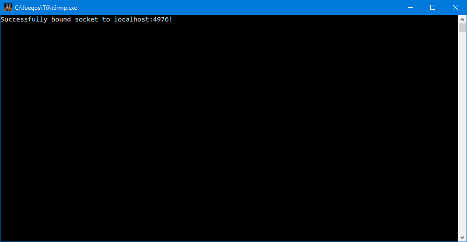
    |
|    
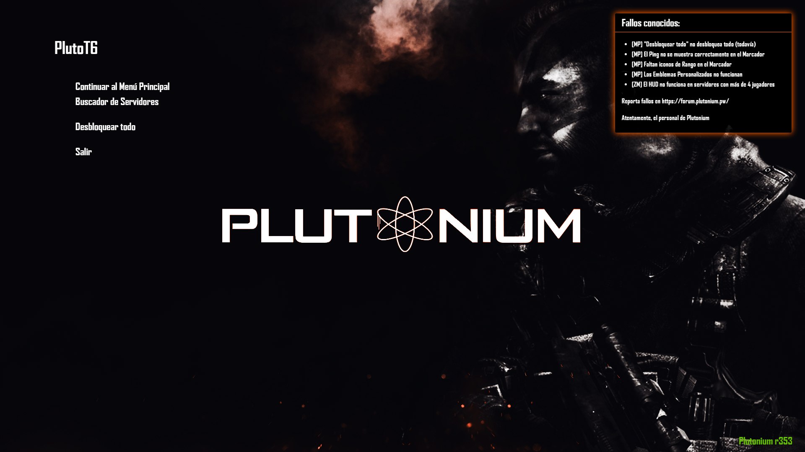    |    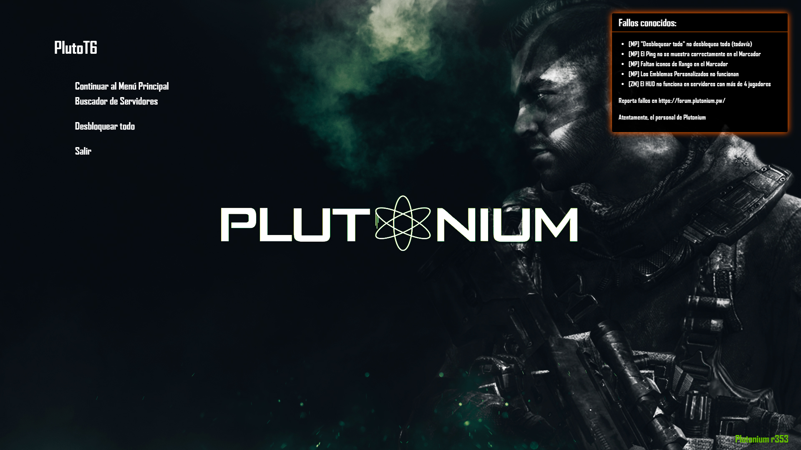
    |
|    
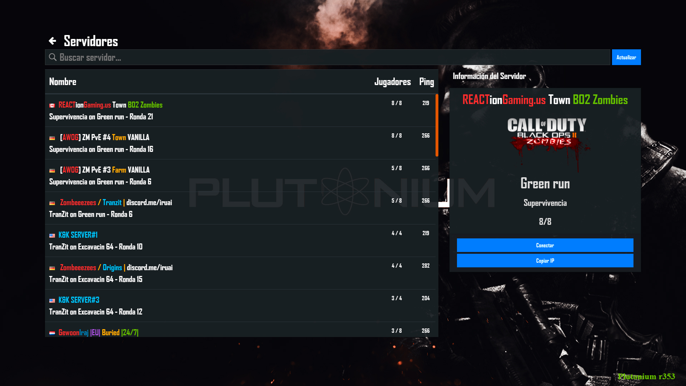    |    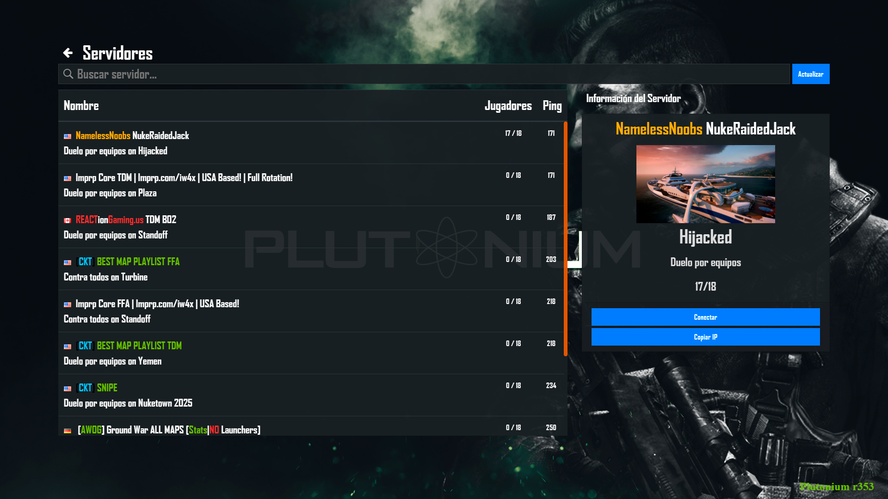
    |
|    
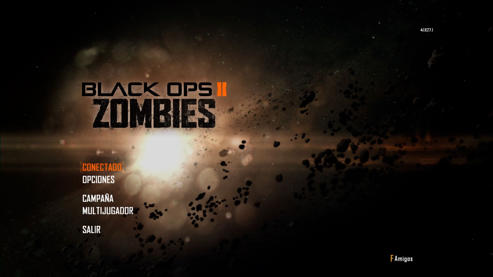    |    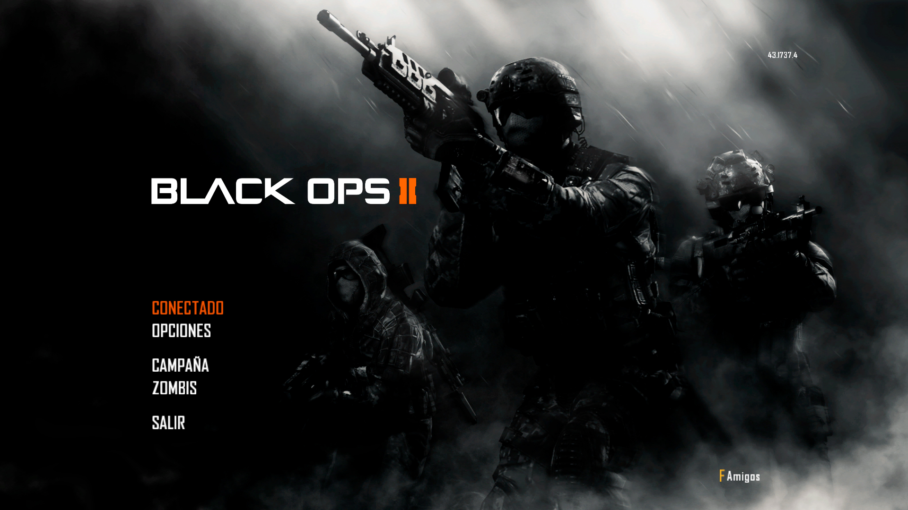
    |
|    
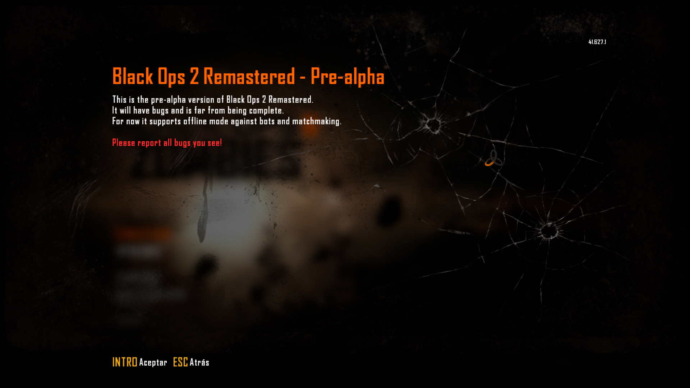    |    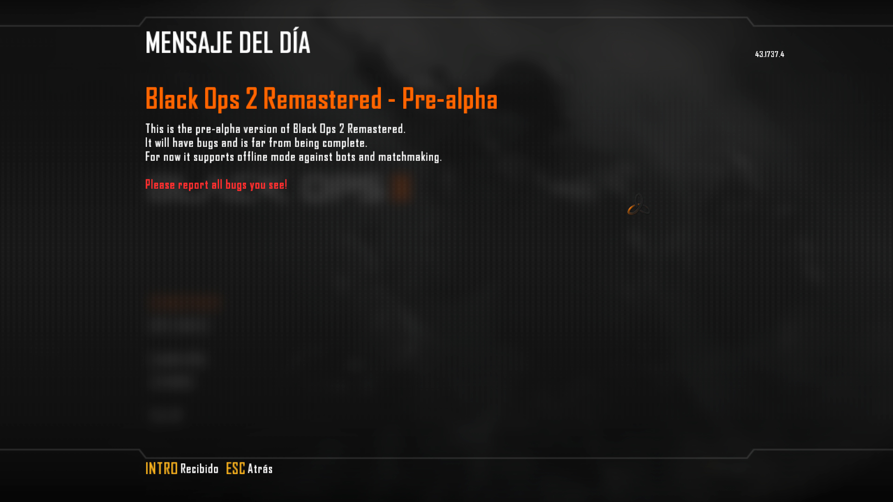
    |
|                                          **Servidor Dedicado** (Modo Zombis)                                          |                                **Servidor Dedicado** (Modo Multijugador)                                |
| 
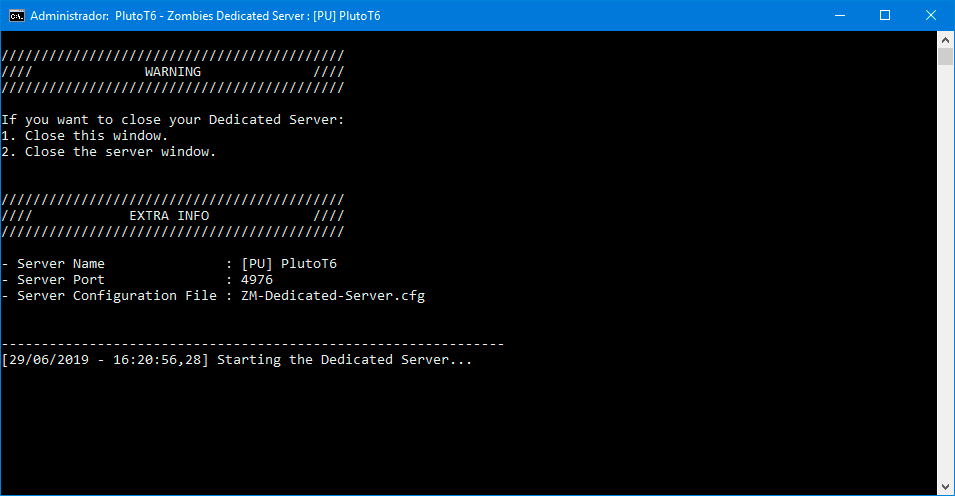 | 
 |
| 
 | 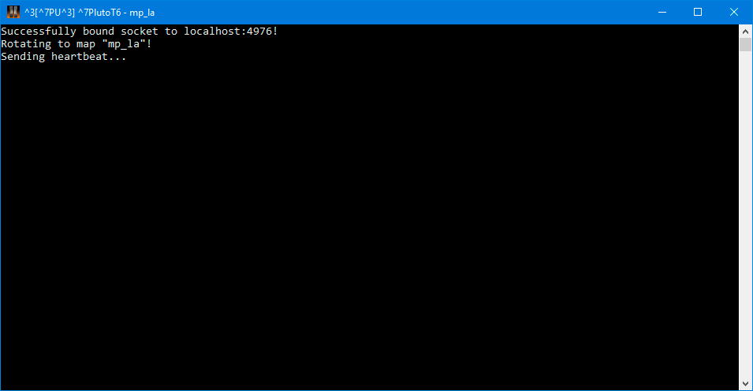
 |
